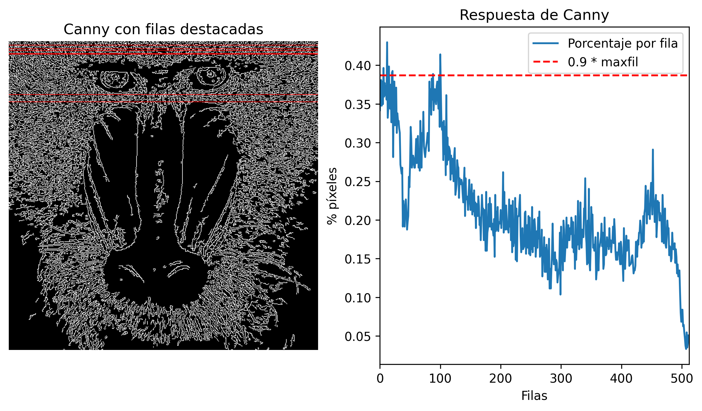
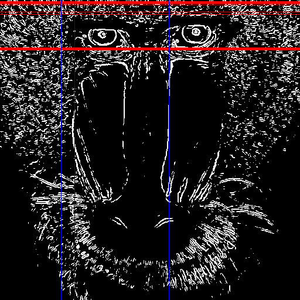
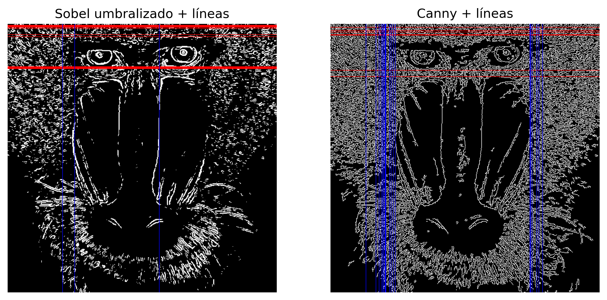

# Práctica 2

**Autores:**  
- Laura Herrera Negrín  
- Ayman Asbai Ghoudan

**Universidad:** Universidad de Las Palmas de Gran Canaria  
**Asignatura:** Visión por Computador  

---

## Tarea 1: Realiza la cuenta de píxeles blancos por filas (en lugar de por columnas). Determina el valor máximo de píxeles blancos para filas, maxfil, mostrando el número de filas y sus respectivas posiciones, con un número de píxeles blancos mayor o igual que 0.90*maxfil.
El objetivo de esta tarea es realizar la **cuenta de píxeles blancos por filas** en una imagen, en lugar de hacerlo por columnas. Se busca determinar el valor máximo de píxeles blancos por fila (`maxfil`) y mostrar las filas que tengan un número de píxeles blancos mayor o igual a 0.90 * `maxfil`.

Para ello, primero se debe **cargar la imagen** `mandril.jpg` desde el disco y **convertirla a escala de grises**, lo que permite detectar bordes utilizando un único canal. A continuación, se aplica el **detector de bordes Canny** (`cv2.Canny(img, threshold1, threshold2)`), en el que `threshold1` y `threshold2` definen los límites para detectar bordes débiles y fuertes, respectivamente. Los píxeles detectados como bordes se representan en blanco (255) y el resto en negro (0).

Una vez obtenida la imagen de bordes, se realiza el **conteo de píxeles blancos por fila** utilizando `cv2.reduce` con la operación de suma. Este valor se normaliza dividiendo por el número de columnas y el valor máximo del píxel (255), obteniendo así el **porcentaje de píxeles blancos por fila**.  

Posteriormente, se determina el **valor máximo de píxeles blancos por fila (`maxfil`)** y se define un **umbral del 90%** de este valor para identificar las filas más relevantes. Se recorren todas las filas y se seleccionan aquellas cuyo porcentaje de píxeles blancos es mayor o igual al umbral. Los resultados se muestran en consola indicando el número de filas que cumplen la condición y sus índices.

Finalmente, se realiza una **visualización gráfica** que incluye:  
1. La imagen resultante del detector de bordes Canny.  
2. Un gráfico del porcentaje de píxeles blancos por fila, con una línea que indica el umbral del 90% de `maxfil`.

Esta visualización permite identificar de manera clara qué filas tienen la mayor concentración de bordes y evaluar la distribución vertical de los contornos en la imagen.

El análisis mostró que la **fila 12** tiene la mayor concentración de bordes en la imagen, alcanzando aproximadamente el **43% de píxeles blancos**. Además, se identificaron otras **6 filas** que superan el 90% del valor máximo, lo que indica que existen varias zonas horizontales con alta densidad de bordes. 

En el resultado gráfico, se puede apreciar que en la imagen se remarcan en color rojo las filas que superan el 90% del número máximo de píxeles no nulos. Se aprecia que estas líneas se concentran principalmente en la parte alta de la cara del mandril, coincidiendo con las zonas de mayor contraste.

## Tarea 2: Aplica umbralizado a la imagen resultante de Sobel (convertida a 8 bits), y posteriormente realiza el conteo por filas y columnas similar al realizado en el ejemplo con la salida de Canny de píxeles no nulos. Calcula el valor máximo de la cuenta por filas y columnas, y determina las filas y columnas por encima del 0.90*máximo. Remarca con alguna primitiva gráfica dichas filas y columnas sobre la imagen del mandril. 
El objetivo de esta tarea es **aplicar un umbral a la imagen resultante del filtro Sobel** y posteriormente realizar el **conteo de píxeles blancos por filas y columnas**, similar al análisis realizado previamente con la salida de Canny. A partir de ello,, busca determinar los valores máximos de píxeles blancos por fila y columna, y resaltar las filas y columnas que superen el **90% de este máximo**.

Para ello, al igual que se hizo anteriormente, se cargará la imagen `mandril.jpg` desde disco y se convierte a escala de grises para el filtro de Canny y se aplica un **desenfoque gaussiano** para suavizar el ruido antes del cálculo del gradiente para Sobel.

A continuación para detectar los bordes con Sobel, se calculan los gradientes horizontales (`sobelx`) y verticales (`sobely`) usando el operador Sobel y  Se obtiene la magnitud del gradiente combinando ambos gradientes y se convirtiéndolo a 8 bits (`sobel8u`).  

Ahora, se aplica un **umbral fijo** a la imagen de Sobel para obtener una imagen binaria (`sobel_umbral`), donde los píxeles de borde se representan en blanco (255).

Con la imagen umbralizada, se realiza el **conteo de píxeles blancos por filas y columnas**, similar al procedimiento realizado en los ejemplos con Canny. Esto permite determinar qué filas y columnas contienen la mayor concentración de bordes. Con ello, se calcula el **valor máximo por fila y por columna**, y se seleccionan aquellas filas y columnas cuyo número de píxeles blancos supera el **90% de este máximo**.
Finalmente, se visualiza en un gráfico el resultado:
   - Las filas que superan el 90% del máximo se remarcan en **rojo** 
   - Las columnas que superan el 90% del máximo se remarcan en **azul**.

  

Se han remarcado más filas que columnas, lo que se puede concluir que, tras umbralizar la imagen, los bordes horizontales son más predominantes que los verticales. Esto indica que hay más cambios de intensidad a lo largo de la dirección vertical (generando bordes horizontales) que a lo largo de la dirección horizontal. En la imagen del mandril, esto se traduce en que los rasgos faciales y las zonas de contraste, como la frente, los ojos o el pelaje, presentan transiciones de intensidad más marcadas horizontalmente.

### ¿Cómo se comparan los resultados obtenidos a partir de Sobel y Canny?

Numéricamente, los resultados son los siguientes:

| Método | Max píxeles por fila | Filas ≥ 0.9·max | Max píxeles por columna | Columnas ≥ 0.9·max |
| ------ | -------------------- | --------------- | ----------------------- | ------------------ |
| Sobel  | 0.3320               | 13              | 0.2969                  | 3                  |
| Canny  | 0.4297               | 7               | 0.3652                  | 19                 |

**Distribución y calidad de los bordes**
* Sobel detecta principalmente bordes horizontales, generando contornos gruesos y dispersos, con más ruido y redundancia.
* Canny resalta bordes finos, continuos y precisos, especialmente verticales, centrados en los contornos relevantes (ojos, hocico, contorno facial).

**Interpretación visual**
* En las imágenes con líneas, se observa que Sobel marca más filas dispersas, mientras que Canny resalta las columnas principales y los contornos importantes.
* Esto refleja la mayor selectividad y robustez del detector de Canny frente a Sobel umbralizado.

**Conclusión final**
* Sobel ofrece un panorama amplio de cambios de intensidad, marcando más filas dispersas.
* Canny es más selectivo, resaltando columnas principales y contornos estructurales importantes.
  
Se puede concluir que Sobel proporciona un mapeo más amplio de bordes, especialmente horizontales aunque con algo ruido, mientras que Canny concentra su detección en bordes significativos y continuos, ofreciendo una visión más limpia y estructural de la imagen.

## Tarea 3: Proponer un demostrador que capture las imágenes de la cámara, y les permita exhibir lo aprendido en estas dos prácticas ante quienes no cursen la asignatura :). Es por ello que además de poder mostrar la imagen original de la webcam, permita cambiar de modo, incluyendo al menos dos procesamientos diferentes como resultado de aplicar las funciones de OpenCV trabajadas hasta ahora.

## Tarea 4: Tras ver los vídeos [My little piece of privacy](https://www.niklasroy.com/project/88/my-little-piece-of-privacy), [Messa di voce](https://youtu.be/GfoqiyB1ndE?feature=shared) y [Virtual air guitar](https://youtu.be/FIAmyoEpV5c?feature=shared) proponer un demostrador reinterpretando la parte de procesamiento de la imagen, tomando como punto de partida alguna de dichas instalaciones.

> Uso de la IA:
- Explicación de algunas funciones de las librerías **OpenCV** y **MatplotLib**
- Estructura y redacción del Readme
