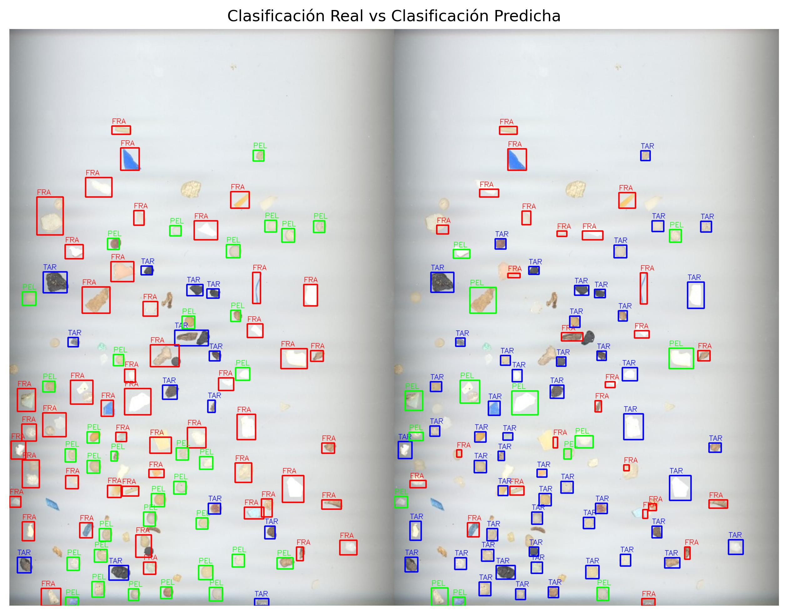
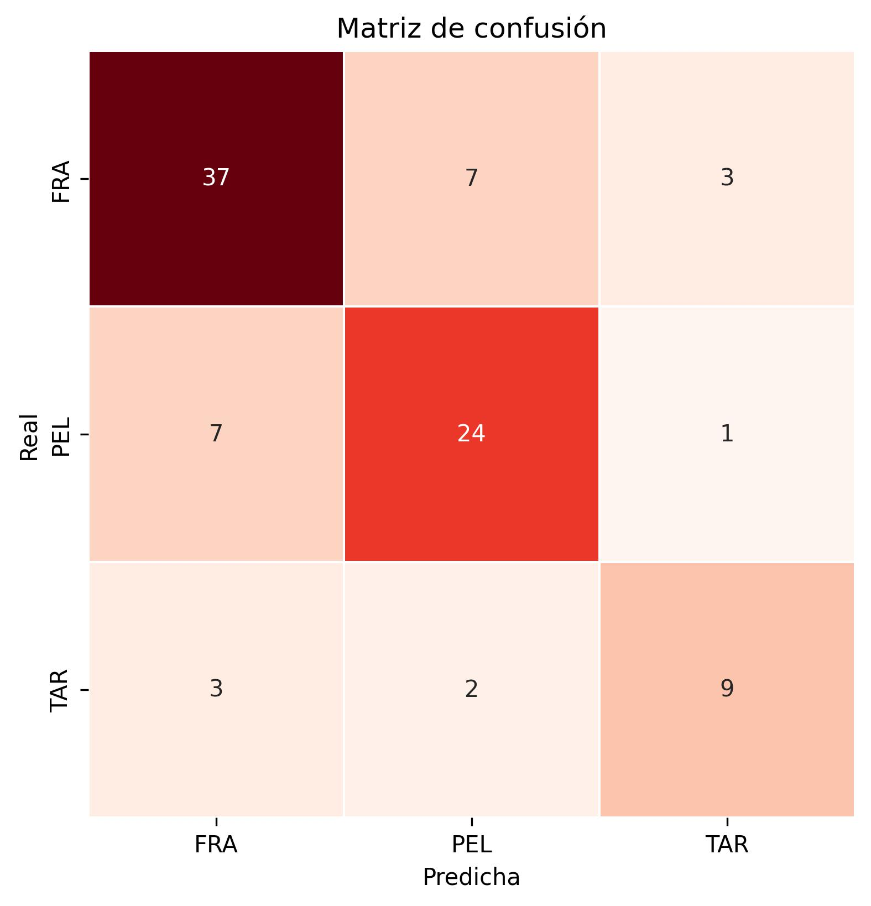

# Práctica 3

**Autores:**  
- Laura Herrera Negrín  
- Ayman Asbai Ghoudan

**Universidad:** Universidad de Las Palmas de Gran Canaria  
**Asignatura:** Visión por Computador  

---
## Contenidos
- [Librerías utilizadas](#librerias)
- [Tarea 1 - Conteo de monedas)](#tarea1)
- [Tarea 2 - Identificación de microplásticos](#tarea2)
---

<a name= "librerias"></a>
## Librerías utilizadas

[](https://numpy.org/)  
- Manipulación eficiente de arreglos y matrices.  
- Cálculos estadísticos y vectoriales sobre las características extraídas.  
- Operaciones matemáticas para medir distancias entre vectores de características.  

 [](https://matplotlib.org/)  
- Visualización de resultados de clasificación (imágenes reales vs predichas).  
- Presentación de comparativas gráficas y figuras informativas.  

[](https://seaborn.pydata.org/)  
- Visualización avanzada de datos.  
- Creación de la **matriz de confusión** mediante mapas de calor con estilo mejorado.  

[](https://scikit-learn.org/stable/)  
- Evaluación del rendimiento del clasificador (exactitud, precisión, recall, F1-score).  
- Normalización de vectores de características con `StandardScaler`.  
- Generación y análisis de la matriz de confusión.  

[](https://docs.python.org/3/library/csv.html)  
- Lectura y manejo de anotaciones desde archivos CSV.  
- Carga de etiquetas reales y coordenadas de bounding boxes para validar la clasificación.  

--- 
<a name="tarea1"></a>
## TAREA 1: Los ejemplos ilustrativos anteriores permiten saber el número de monedas presentes en la imagen. ¿Cómo saber la cantidad de dinero presente en ella? Sugerimos identificar de forma interactiva (por ejemplo haciendo clic en la imagen) una moneda de un valor determinado en la imagen (por ejemplo de 1€). Tras obtener esa información y las dimensiones en milímetros de las distintas monedas, realiza una propuesta para estimar la cantidad de dinero en la imagen. Muestra la cuenta de monedasW y dinero sobre la imagen. No hay restricciones sobre utilizar medidas geométricas o de color. 


---
<a name="tarea2"></a>
## TAREA 2: La tarea consiste en extraer características (geométricas y/o visuales) de las tres imágenes completas de partida, y *aprender* patrones que permitan identificar las partículas en nuevas imágenes. Para ello se proporciona como imagen de test *MPs_test.jpg* y sus correpondientes anotaciones *MPs_test_bbs.csv* con la que deben obtener las métricas para su propuesta de clasificación de microplásticos, además de la matriz de confusión. La matriz de confusión permitirá mostrar para cada clase el número de muestras que se clasifican correctamente de dicha clase, y el número de muestras que se clasifican incorrectamente como perteneciente a una de las otras dos clases.

En el trabajo [SMACC: A System for Microplastics Automatic Counting and Classification](https://doi.org/10.1109/ACCESS.2020.2970498), las características geométricas utilizadas fueron:

- Área en píxeles
- Perímetro en píxeles
- Compacidad (relación entre el cuadrado del perímetro y el área de la partícula)
- Relación del área de la partícula con la del contenedor
- Relación del ancho y el alto del contenedor
- Relación entre los ejes de la elipse ajustada
- Definido el centroide, relación entre las distancias menor y mayor al contorno

Esta tarea implementa un **sistema de clasificación de microplásticos** en imágenes, utilizando técnicas de **visión por computador**. A partir de imágenes de referencia, el sistema **extrae características geométricas y de color** de cada partícula, entrena un clasificador simple basado en distancia euclidiana ponderada, y evalúa su rendimiento en una imagen de prueba con anotaciones.

### ⚙️ Funciones principales

A continuación se describen las principales funciones implementadas para llevar a cabo este proceso:
```py 
detectar_caracteristicas(contorno, imagen_hsv)
```
Extrae un conjunto de **características geométricas y de color** a partir de un contorno detectado:  
- Área, perímetro, compacidad, excentricidad.  
- Relaciones de forma (ancho/alto, área relativa, distancias al centroide).  
- Estadísticas del color en HSV (media y desviación).

---

```py 
extraer_caracteristicas_imagen(imagen_path)
```
Procesa una imagen completa:  
- Convierte a escala de grises.  
- Aplica desenfoque y umbral adaptativo para separar objetos del fondo.  
- Encuentra contornos y calcula sus características con la función anterior.

---

```py
vector_caracteristicas_medio(imagen_path)
```
- Obtiene el **vector medio de características** de todos los objetos de una imagen.
- Se usa para representar cada clase (tipo de microplástico) de forma promedio.

---

```py
entrenar_clasificador(imagenes_referencia)
```
- Calcula el vector de características medio para cada clase (por ejemplo, FRA, PEL, TAR) usando imágenes de referencia. Estos serán la **base del clasificador**.

---

```py 
preparar_referencias(mean_vectors)
```
- Normaliza los vectores de referencia con `StandardScaler` y define un **vector de pesos** que ajusta la importancia de cada característica (por ejemplo, más peso al color o a la forma).  

La normalización es importante porque las características pueden tener escalas muy diferentes (por ejemplo, el área puede tener valores miles de veces mayores que la compacidad o el color), lo que haría que unas dominen sobre otras al calcular distancias o similitudes. 
Al usar `StandardScaler`, todas las características se transforman para tener **media cero** y **varianza unitaria**, garantizando que ninguna domine sobre las demás.
Luego, los pesos permiten dar más relevancia a las características más discriminativas según el contexto, logrando comparaciones más justas y representativas.

---

```py 
clasificar_contorno(...)
```
- Dada una región de interés (bounding box), calcula las características del contorno y las compara con las referencias.
- Clasifica el objeto según la **distancia euclidiana ponderada más corta**.

---

```py 
clasificar_imagen_con_anotaciones(...)
```
Procesa una imagen completa y sus anotaciones (desde un CSV):  
- Detecta contornos.  
- Clasifica cada objeto dentro de las regiones anotadas.  
- Devuelve las etiquetas reales y predichas junto con la imagen combinada para visualización.  

---

```py 
mostrar_resultado_visual(y_true, y_pred, imagen_combined)
```
- Muestra visualmente los resultados de clasificación (reales vs predichos) y calcula la precisión global del modelo.



Tal y como se observa en la imagen, la parte izquierda muestra la clasificación real (según las anotaciones del archivo CSV) y la parte derecha muestra la clasificación predicha por el modelo.

Cada tipo de microplástico está representado con un color diferente:
* 🟥 Fragmentos (FRA): contornos y etiquetas en rojo.
* 🟩 Pellets (PEL): contornos y etiquetas en verde.
* 🟦 Alquitrán (TAR): contornos y etiquetas en azul.

De esta forma, es posible comparar visualmente de un vistazo las predicciones y los aciertos.
En general, la mayoría de los objetos coinciden correctamente entre ambas imágenes, aunque se aprecian algunas discrepancias: 
- Algunos fragmentos rojos fueron clasificados erróneamente como pellets verdes, lo que coincide con la confusión detectada en la matriz de confusión.
- Las partículas de alquitrán azul suelen estar correctamente clasificadas, aunque en ciertos casos con forma irregular o bordes difusos el modelo las confundió con fragmentos.
- La distribución general de colores muestra una buena correspondencia global entre las clasificaciones reales y las predichas, lo que respalda el resultado cuantitativo obtenido (accuracy ≈ 72 %).

---
```py 
mostrar_matriz_confusion(y_true, y_pred, clases)
```
- Genera un **heatmap de la matriz de confusión** con Seaborn para visualizar los aciertos y errores del clasificador.  

La matriz de confusión obtenida es: 


La **matriz de confusión** muestra, para cada clase real, cómo el clasificador asignó las predicciones.  
Cada fila representa las **etiquetas reales**, y cada columna las **etiquetas predichas**.

Interpretación:
- **Diagonal principal (37, 24, 9):** son los aciertos del modelo → el objeto se clasificó correctamente.  
- **Fuera de la diagonal:** representan errores de clasificación (confusiones entre clases).  

#### 🔍 Análisis detallado:
- La clase **FRA** (fragmentos) tuvo **37 aciertos**, pero fue confundida **7 veces con PEL** (pellets) y **3 veces con TAR** (tiras).  
  Esto sugiere que algunos fragmentos comparten **formas o colores similares a los pellets**, lo que genera confusión.
  
- La clase **PEL** tuvo un rendimiento sólido (**24 aciertos**, 7 errores hacia FRA).  
  Nuevamente, la mayor confusión se da entre **FRA ↔ PEL**, lo que indica que ambas clases tienen **características geométricas o cromáticas parecidas**.

- La clase **TAR** obtuvo **9 aciertos**, pero también se confundió en **3 casos como FRA** y **2 como PEL**.  
  Al ser posiblemente más oscura o de forma irregular, puede haberse interpretado erróneamente según la iluminación o textura.

En conjunto, el **patrón de confusión dominante** es entre **fragmentos (FRA)** y **pellets (PEL)**, lo que sugiere que el modelo podría beneficiarse de:
- Aumentar el peso de las características **de color** (HSV).  
- Añadir más imágenes de entrenamiento para ambos tipos.  
- Aplicar segmentación más precisa para evitar que fragmentos incompletos afecten el cálculo de características.  

Sin embargo, se intentó cambiar el peso de las distintas características pero, el resultado obtenido era peor que este pues, a la vez que mejoraba un elemento en concreto, los otros dos empeoraban.

---

```py 
imprimir_metricas(y_true, y_pred)
```
Esta función calcula las métricas del clasificador:
| Métrica | Descripción | Valor (%) |
|----------|--------------|-------|
| **Exactitud (Accuracy)** | Porcentaje total de clasificaciones correctas sobre todas las predicciones. | 72.16|
| **Precisión** | Qué tan precisas son las predicciones positivas (por clase). Indica el nivel de “falsos positivos” cometidos. | 75.25|
| **Sensibilidad (Recall)** | Mide la capacidad del modelo para detectar correctamente todos los objetos de una clase (minimiza los falsos negativos). | 72.16|
| **F1-Score** | Promedio armónico entre precisión y recall; balance entre exactitud y cobertura. | 73.67|

### 📈 Interpretación de las métricas:
- El modelo logra un rendimiento moderado-alto, identificando correctamente alrededor del 72 % de los microplásticos.
- La precisión del 75 % indica que la mayoría de las predicciones son correctas, mientras que un recall similar muestra que el sistema detecta bien las clases, aunque aún pierde algunos objetos.
- El F1-score de 73.67 % refleja un equilibrio adecuado entre precisión y cobertura.

En conjunto, los resultados son satisfactorios considerando la simplicidad del clasificador y la variabilidad visual de las muestras.
